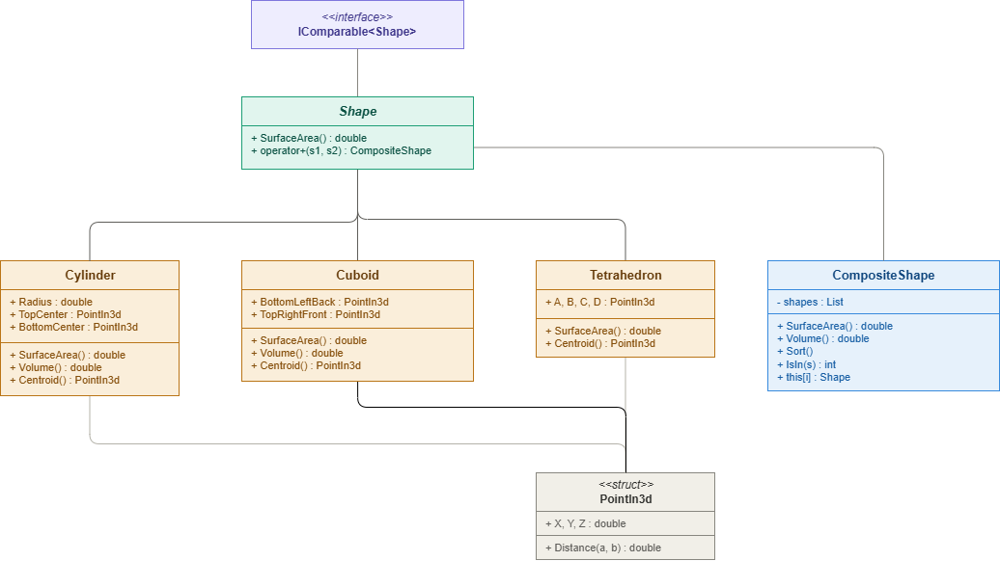

# Report

Course: C# Development SS2025 (4 ECTS, 3 SWS)

Student ID: cc241007

BCC Group: Group C

Name: Diana Ivanova

## Methodology

The assignment was split into two folders: a class library called `GeometryLibrary` and a console application called `Computation`.

For `GeometryLibrary`, I started by implementing the abstract base class `Shape`, which defines the shared interface for all shapes. It implements `IComparable<Shape>` using `CompareTo()` so shapes can be sorted by surface area, and it overloads the `+` operator to combine two shapes into a `CompositeShape`.

Each concrete shape (`Cylinder`, `Cuboid`, `Tetrahedron`) inherits from `Shape` and has its own constructors: a random default constructor, a copy constructor, and a full constructor with explicit parameters. Each shape also overloads `==` and `!=` for value-based comparison and overrides `Equals()` so it works correctly when shapes are used inside collections.

I also implemented a `PointIn3d` struct to represent points in 3D space. It includes a static `Distance()` method that uses the 3D Pythagorean theorem to calculate the straight-line distance between two points.

For the math:
- **Cuboid**: surface area and volume are calculated from the differences between two opposite corner points (bottom-left-back and top-right-front), which is enough to fully define all six faces.
- **Cylinder**: height is the distance between the two center points. Surface area includes both circular faces and the lateral surface.
- **Tetrahedron**: surface area is the sum of four triangle areas. Each triangle area is calculated using the dot product to find the angle between two edge vectors, then applying the formula `0.5 * |AB| * |AC| * sin(angle)`.

`CompositeShape` holds a `List<Shape>` internally and exposes an indexer, a `Sort()` method, an `IsIn()` method that returns the index of a shape or -1 if not found, and combined `SurfaceArea()` and `Volume()` methods. Volume skips `Tetrahedron` since it does not have a volume calculation.

The `Computation` project creates instances of each shape, combines them using the `+` operator, adds more shapes manually, sorts the composite by surface area, searches for a shape with `IsIn()`, accesses it with the indexer, and creates a copy using the copy constructor.

## Class diagram

## Additional Features

No additional features were implemented beyond the assignment requirements.

## Discussion/Conclusion

The main challenges I faced during this assignment were:

Firstly, I had forgotten how 3D geometry works and it took some time to get back into it. Calculating the surface area and volume of a cuboid from just two corner points was unfamiliar at first, but after reading about it I could see it was a clean and efficient approach since all the dimensions can be calculated from the coordinate differences.

Finding the triangle area in 3D space for the tetrahedron shape was also challenging. I needed to find the area of a triangle defined by three points in 3D space. I chose to use the dot product and angle method: calculating two edge vectors from a shared corner, finding the angle between them using `Math.Acos()`, and then applying the formula `0.5 * |AB| * |AC| * sin(angle)`, as it was already familiar to me from math problems I learned about in high school.

## Work With

I worked on this assignment individually.

## Reference

- GeeksForGeeks: Volume and Surface Area of Cuboid: https://www.geeksforgeeks.org/dsa/program-for-volume-and-surface-area-of-cuboid/
- Math StackExchange: How to calculate the area of a 3D triangle: https://math.stackexchange.com/questions/128991/how-to-calculate-the-area-of-a-3d-triangle
- Course material and lecture slides: https://yun-vis.net/ustp-bcc-csharp/
